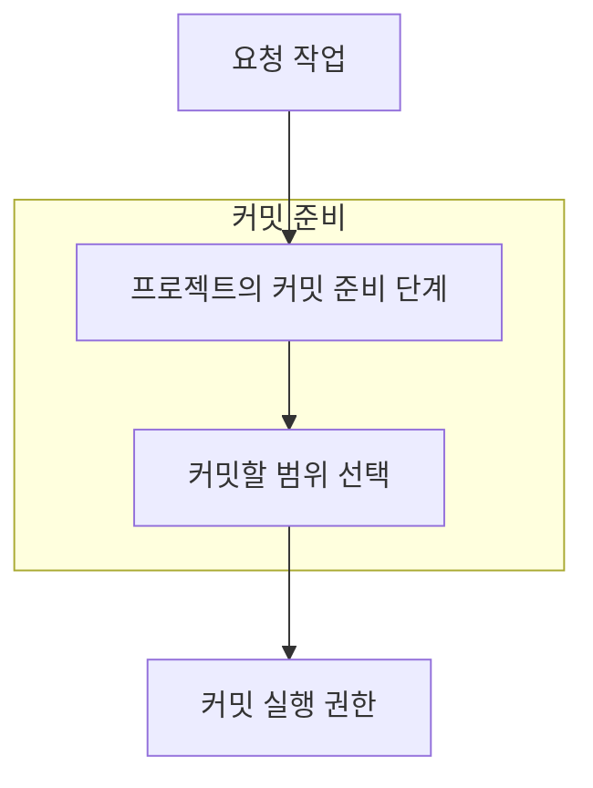
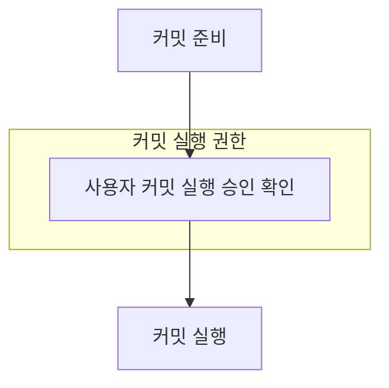
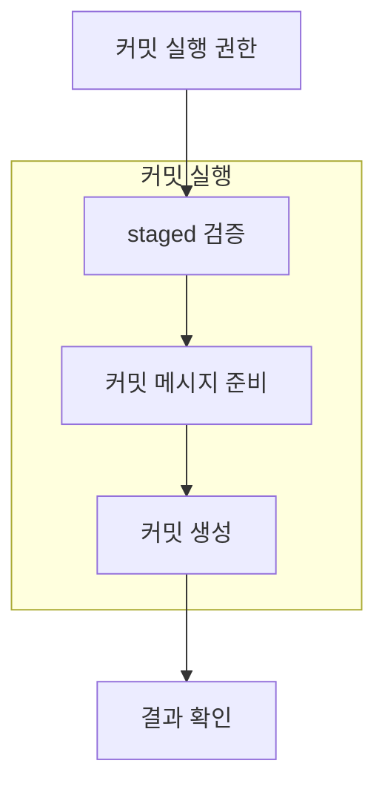

## 사용자 스펙 의도

- 직접 만든 변경을 task-scoped commit으로 깔끔하게 마무리하고 싶다.
- staged scope 검토와 수동 검증을 거친 뒤 commit하고 싶다.
- commit message 형식과 body 품질을 같이 통제하고 싶다.
- `commit-readiness-gate`는 readiness 판단을 맡고, 실제 commit finalization은 `git-committer`가 맡아야 한다.
- `git-committer`는 readiness, 검증 통과, handoff만으로 commit 실행 승인을 추정하지 않아야 한다.
- `git-committer` 스펙은 folder-based 구조로 두고, intent에는 readiness에서 commit 실행까지의 흐름도가 보여야 한다.
- `git-committer`의 흐름도는 커밋 준비, 커밋 실행 권한, 커밋 실행 흐름을 분리해서 보여야 한다.

## 전체 흐름도

## 커밋 준비 흐름도

## 커밋 실행 권한 흐름도

## 커밋 실행 흐름도

