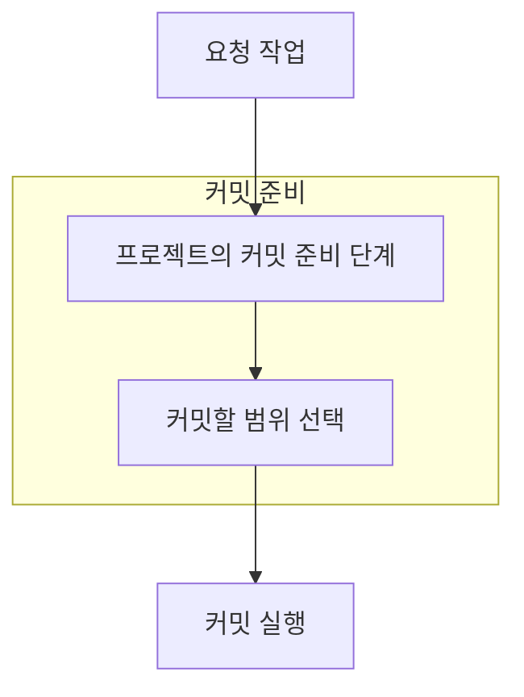
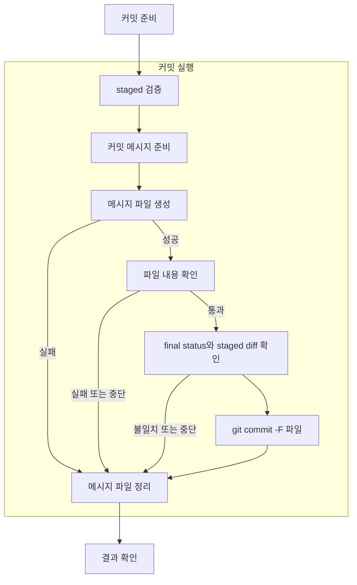

## 사용자 스펙 의도

- 직접 만든 변경을 task-scoped commit으로 깔끔하게 마무리하고 싶다.
- staged scope 검토와 수동 검증을 거친 뒤 commit하고 싶다.
- commit message 형식과 body 품질을 같이 통제하고 싶다.
- `commit-readiness-gate`는 readiness 판단을 맡고, 실제 commit finalization은 `git-committer`가 맡아야 한다.
- `git-committer`는 readiness, 검증 통과, handoff만으로 commit 실행 승인을 추정하지 않아야 한다.
- `git-committer` 스펙은 folder-based 구조로 두고, intent에는 readiness에서 commit 실행까지의 흐름도가 보여야 한다.
- `git-committer`의 흐름도는 커밋 준비, 커밋 실행 권한, 커밋 실행 흐름을 분리해서 보여야 한다.
- commit message는 Bash heredoc/EOF나 표준입력으로 직접 주입하지 않고, 별도 파일 생성 > `git commit -F <file>` > 파일 정리 순서로 전달해야 한다.
- 메시지 파일 생성, 내용 확인, commit 실행, 파일 정리는 실패와 중단 경로까지 통제하는 gate여야 한다.
- `PR 올려놔`처럼 commit을 포함하는 상위 작업 요청은 commit 실행도 허용한 것으로 처리하고 별도 commit 승인을 다시 요구하지 않아야 한다. 변경만 요청한 상태에서의 자의적 commit 방지는 상위 요청 범위가 맡으며, `git-committer` 내부의 별도 승인 절차는 두지 않는다.
- 메시지 파일 lifecycle에서는 allocator가 만든 단일 파일만 사용하고, exact path의 `unlink` 결과로 cleanup 상태를 판단하고 싶다.
- commit 실행에 항상 필요한 명령, 메시지, 검증 계약은 별도 reference를 추가로 읽지 않고 단일 runtime `SKILL.md`에서 함께 제공받고 싶다.

## 전체 흐름도

## 커밋 준비 흐름도

## 커밋 실행 흐름도

