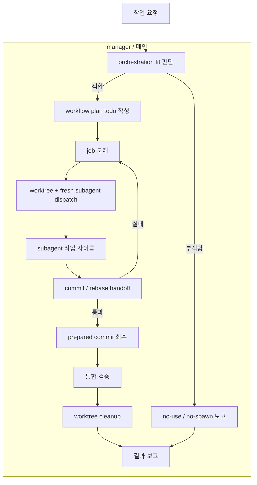
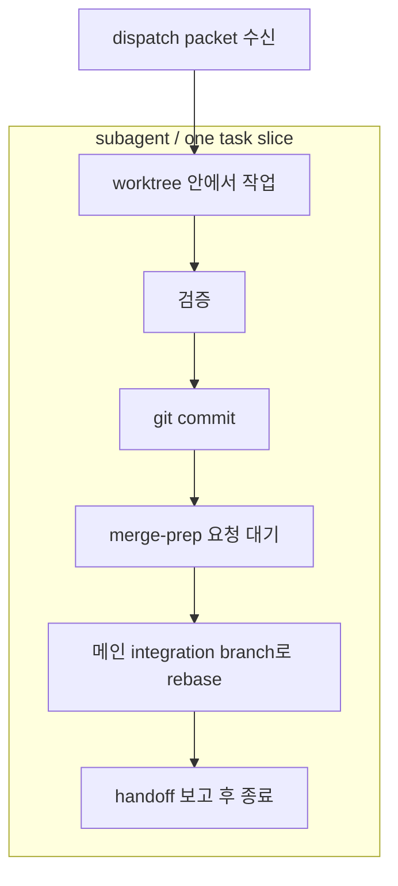
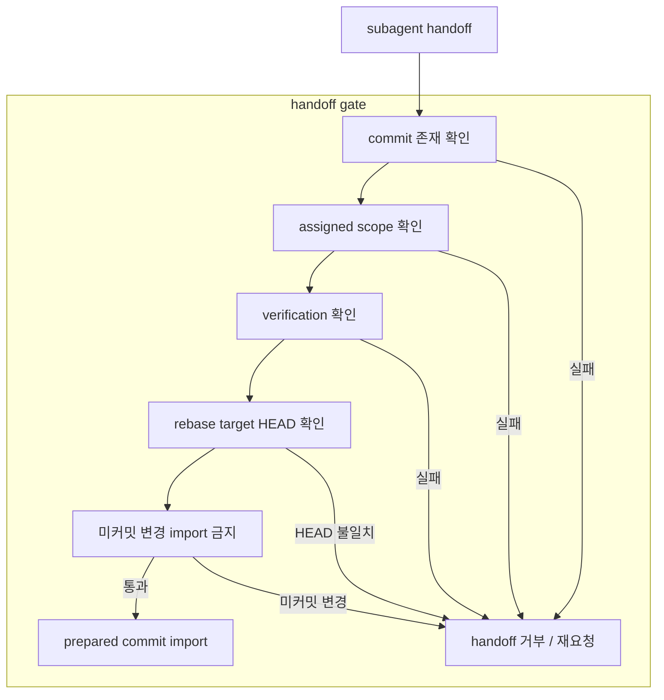

# manager 사용자 의도

## 전체 플로우

## subagent 작업 사이클

## handoff gate

## 사용자 스펙 의도

- 새로운 루프 스킬을 만들려고 한다. 이 스킬을 사용하면 해당 에이전트는 오케스트레이션으로서 동작한다. subagent가 모든 작업을 진행해야 한다. 어떤 작업을 받으면 그 작업을 구조분해해서 git worktree로 구분해 subagent를 구동한다. 각각의 worktree에서 작업이 완료되면 그 작업분을 커밋해서 메인 작업위치에 커밋을 가져오고, 작업하던 worktree는 정리해야 한다. 구조분해 방식은 문제를 해결하는 방식, 코드를 구분하는 방식, workflow를 구분하는 방식 등 다양한 기준점이 필요하다.
- subagent 사이클도 지정해야 한다. 작업 시작부터 작업 완료까지 subagent가 동작하고, 작업 완료가 되면 subagent는 종료한다. 다음 작업을 위해 새로 생성한다. subagent의 작업 완료는 git commit 이후, 메인 에이전트가 병합 준비를 요청하면 subagent가 메인 에이전트가 동작하는 브랜치로 rebase하고, 완료되면 메인 에이전트가 해당 커밋을 가져온다. rebase는 완료된 상태이기 때문에 conflict는 발생할 가능성이 없다.
- 플러그인 이름은 `baton-relay`로 정한다. 스킬 이름은 `manager`로 정한다.
- `manager` 스펙을 폴더화하고, `src/loop-kit-dev/specs/skills/turn-gate/intent.md`처럼 단순한 전체 플로우 그래프를 둔다.

## 핵심

### manager 경계

- `manager`는 메인 에이전트를 구현자가 아니라 orchestration manager로 세웁니다.
- 실제 task slice 작업은 fresh subagent가 담당합니다.
- `manager`는 Markdown workflow plan, worktree, subagent lifecycle, commit/rebase handoff, prepared commit 회수, cleanup gate를 소유합니다.
- `manager`는 subagent runtime, GitHub publish workflow, release workflow, 특정 언어 구현 전략을 소유하지 않습니다.

### relay loop

- 작업 요청은 먼저 orchestration fit 판단으로 들어갑니다.
- 부적합하면 `no-use / no-spawn`으로 보고하고 caller-local handling을 제시합니다.
- 적합하면 먼저 `Workflow > Jobs > Runs` 계층의 Markdown todo 계획 문서를 작성합니다.
- 메인 에이전트는 repo PM처럼 workstream, write scope, dependency, parallel blockers, acceptance 기준으로 job을 나눕니다.
- 각 subagent job은 worktree, runs, acceptance, handoff 기준을 가진 실행 가능한 todo 단위여야 합니다.
- subagent는 작업, 검증, commit, rebase, handoff 보고 후 종료합니다.
- 메인 에이전트는 prepared commit만 회수하고 미커밋 변경은 가져오지 않습니다.

### handoff와 cleanup

- handoff gate는 commit 존재, scope, verification, rebase target HEAD, 미커밋 변경 없음 상태를 확인합니다.
- gate 실패 시 import하지 않고 재요청, 순서 재설계, scope 축소, 또는 blocked 처리를 선택합니다.
- worktree cleanup은 useful evidence와 prepared commit 상태가 처리되고 필요한 통합 검증이 끝난 뒤에만 수행합니다.
