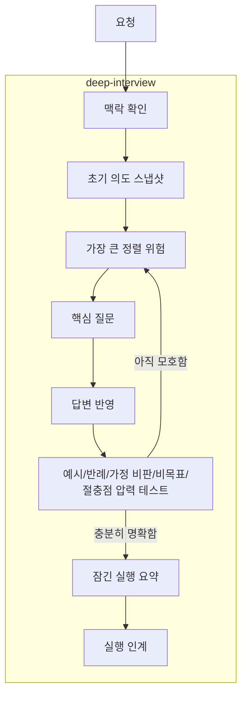

# deep-interview 사용자 의도

- 실제 요구사항을 조언형 답변이 아니라 질문 라운드로 잠그고 싶다.
- 의도, 범위, 절충점, 승인 경계를 명시적으로 확인하고 싶다.
- 충분한 명확성을 얻으면 다음 실행 경로로 자연스럽게 인계하고 싶다.
- `deep-interview` 스킬을 `loop-kit`의 독립 하위 인터뷰 skill로 관리하고 싶다.
- `deep-interview-adaptation` 별도 문서는 스킬 스펙에 녹이고, `deep-interview` 스펙을 폴더 기반 스펙으로 관리하고 싶다.
- 하위 인터뷰 skill 안에는 상위 skill 맥락을 넣지 않고 싶다.

## 전체 구조

## 핵심

- `deep-interview`는 요구사항 파악과 방향 잠금이 병목일 때 조언형 답변으로 끝내지 않고 질문 라운드로 들어갑니다.
- 핵심 질문은 가장 큰 요구사항 불확실성을 줄이는 질문입니다.
- 질문은 의도, 범위, 비목표, 절충점, 수용 기준을 잠그는 방향으로 진행합니다.
- repository fact는 먼저 로컬에서 확인하고, 확인할 수 없는 요구사항 정보만 사용자에게 묻습니다.
- 답변은 예시, 반례, 가정 비판, 명시적 비목표, 또는 절충점으로 압력 테스트합니다.
- 답변이 여전히 모호하면 같은 요구사항 불확실성을 다시 좁힙니다.
- 충분한 명확성을 얻으면 실행 준비 또는 방향 잠금 요약을 만들고 다음 작업 흐름으로 인계합니다.
