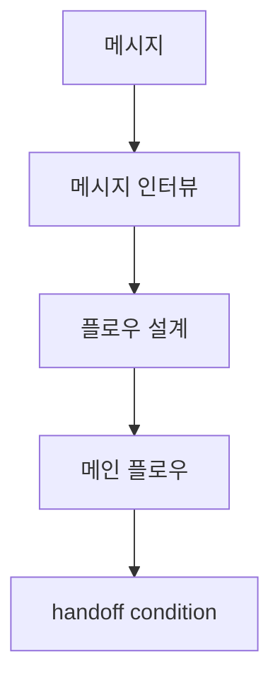
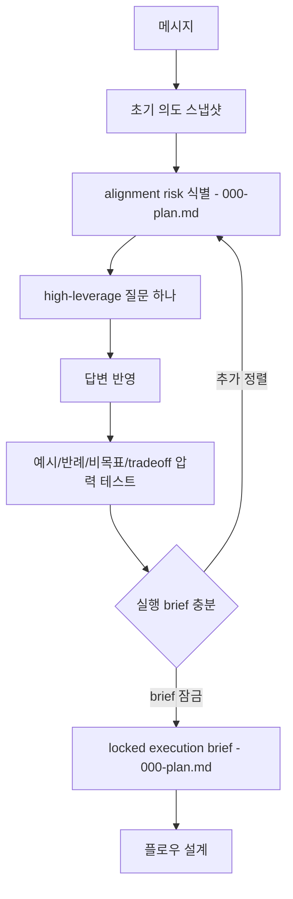
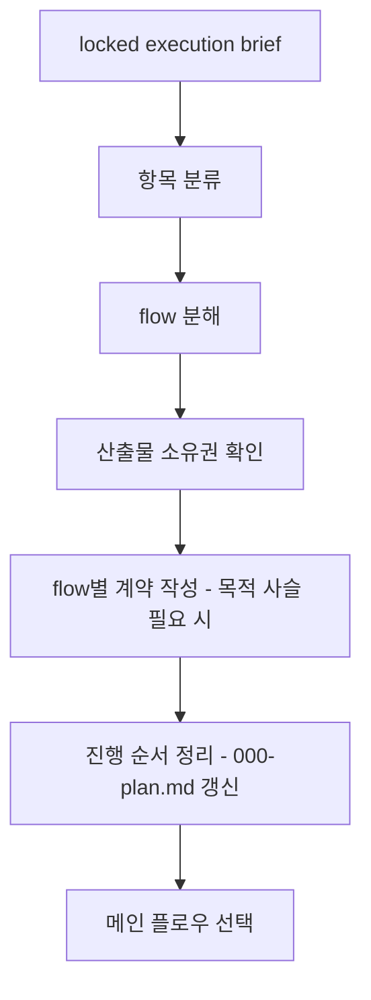
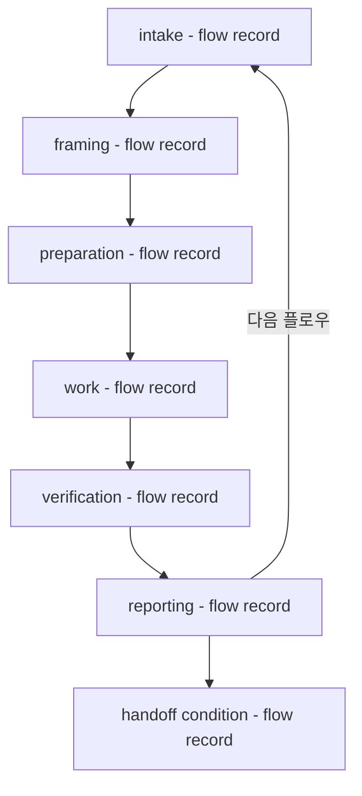
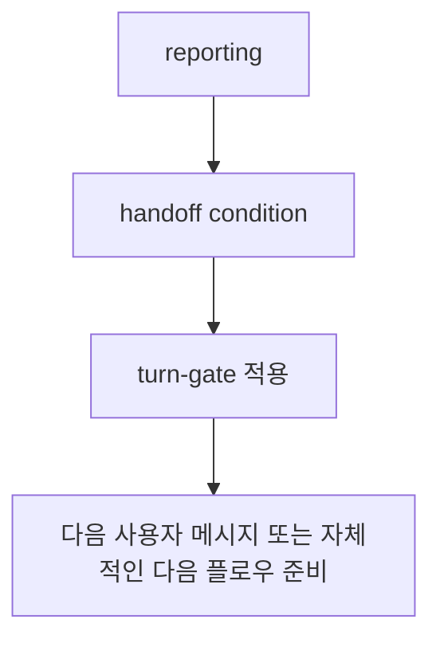
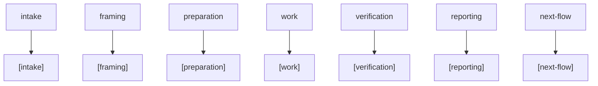

# flow 사용자 의도

## 전체 구조

## 메시지 인터뷰

## 플로우 설계

## 메인 플로우

## 핵심

- 메시지가 들어오면 `flow`는 메시지를 해석하고 실제 진행할 flow를 함께 설계합니다.
- 실제 진행할 플로우가 정해지면 각 메인 플로우는 `intake -> framing -> preparation -> work -> verification -> reporting`으로 진행합니다.
- 메인 플로우는 `reporting`에서 종료하고 `handoff condition`을 산출합니다.
- 다음 flow가 있으면 `reporting`에서 다음 `intake`로 라우팅합니다.
- `handoff condition`은 메인 플로우 종료 뒤 산출되는 종료 조건입니다.
- 여러 플로우가 필요하면 리스트업 결과가 여러 메인 플로우가 될 수 있습니다.
- 메시지 인터뷰는 deep-interview 역할을 flow 내부 해석 단계로 흡수합니다.
- flow 내부 deep-interview는 alignment risk를 식별하고, 한 번에 하나의 high-leverage 질문으로 답변을 압력 테스트합니다.
- 답변이 여전히 모호하면 같은 alignment risk를 다시 좁힙니다.
- 플로우 설계는 진행할 flow 구성을 만들고 바로 메인 flow `intake`로 들어갑니다.
- `000-plan.md`와 flow record는 각 그래프 노드의 업데이트 시점으로 표시합니다.

## handoff condition

## 단계 메시지 표기

## 단계 메시지 표기 핵심

- 기존 규칙 위치: `turn-gate` runtime 계약과 phase-prefix scenario.
- `flow`는 phase 이름과 의미를 제공합니다.
- `turn-gate`는 사용자에게 보이는 phase 시작 또는 의미 있는 진행 메시지에 prefix를 적용합니다.
- prefix 목록은 `[intake]`, `[framing]`, `[preparation]`, `[work]`, `[verification]`, `[reporting]`, `[next-flow]`입니다.
- artifact, record, command summary, question option label은 각 표면의 원래 형식을 유지합니다.

## 플로우 설계 핵심

- 항목 분류는 active flow, parent flow, sub-flow candidate, phase, handoff를 구분합니다.
- flow 분해는 단일 메인 flow로 충분한지, 여러 메인 flow가 필요한지 정리합니다.
- 산출물 소유권 확인은 어떤 flow가 어떤 artifact 변경을 소유하는지 드러냅니다.
- flow별 계약 작성은 scope, non-goals, completion criteria, verification expectation, approval boundary, handoff condition을 정리합니다.
- 진행 순서 정리는 다음에 들어갈 메인 flow와 이후 후보를 구분하고 `000-plan.md` 갱신 시점입니다.
- flow record는 메인 플로우 phase, evidence, verification, reporting 시점에서 갱신합니다.
- 목적 사슬은 contract에 영향을 줄 때 `000-plan.md`의 목적 섹션에 흡수합니다.
