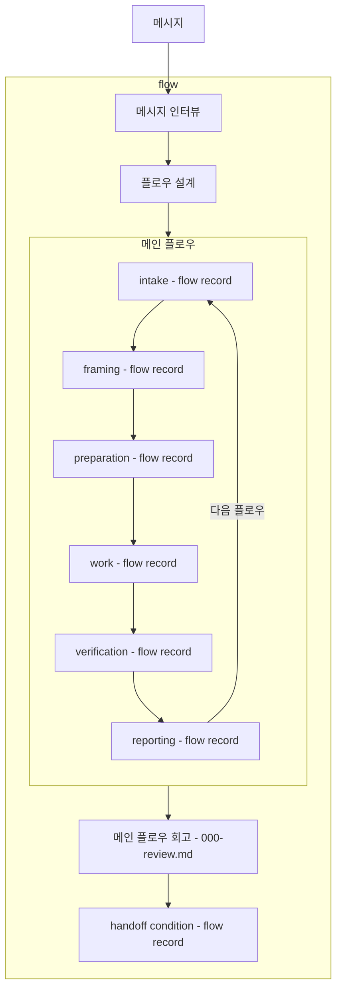
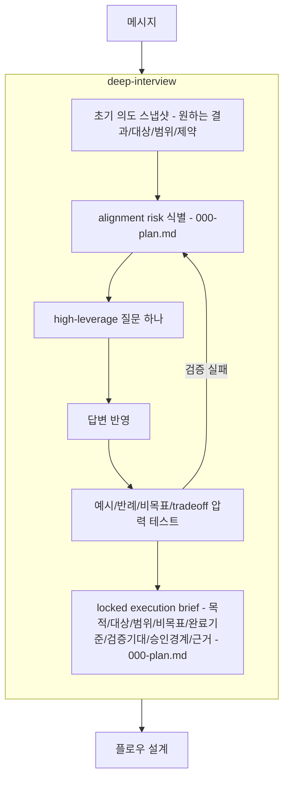
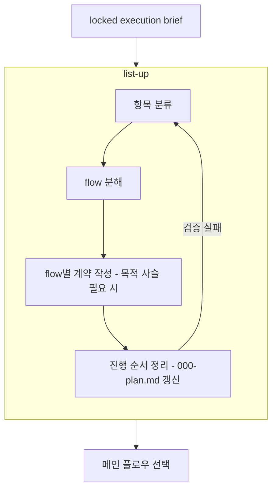

# flow 사용자 의도

## 전체 구조

## 메시지 인터뷰

## 플로우 설계

## 핵심

- 메시지가 들어오면 `flow`는 메시지를 해석하고 실제 진행할 flow를 함께 설계합니다.
- 실제 진행할 플로우가 정해지면 각 메인 플로우는 `intake -> framing -> preparation -> work -> verification -> reporting`으로 진행합니다.
- 다음 flow가 있으면 `reporting`에서 다음 `intake`로 라우팅합니다.
- 메인 플로우 그룹 이후 결과는 `메인 플로우 회고 -> handoff condition`입니다.
- `handoff condition`은 메인 플로우 종료 뒤 산출되는 종료 조건입니다.
- 여러 플로우가 필요하면 리스트업 결과가 여러 메인 플로우가 될 수 있습니다.
- 메시지 인터뷰는 deep-interview 역할을 flow 내부 해석 단계로 흡수합니다.
- flow 내부 deep-interview는 alignment risk를 식별하고, 한 번에 하나의 high-leverage 질문으로 답변을 압력 테스트합니다.
- 답변이 여전히 모호하면 같은 alignment risk를 다시 좁힙니다.
- 초기 의도 스냅샷은 원하는 결과, 대상, 범위, 제약을 드러냅니다.
- alignment risk는 locked execution brief를 실행 입력으로 쓰기 어렵게 만드는 가장 큰 불확실성입니다.
- high-leverage 질문은 하나의 alignment risk를 좁히기 위해 사용합니다.
- locked execution brief는 목적, 대상, 범위, 비목표, 완료 기준, 검증 기대, 승인 경계, 근거, 해소된 alignment risk, 남은 모호성을 현재 확정 상태로 남깁니다.
- 모든 사용자 메시지는 같은 메시지 인터뷰와 플로우 설계 경로를 거쳐 메인 플로우로 처리합니다.
- 메시지 인터뷰가 충분히 잠긴 brief를 만들면 사용자 질문 없이 플로우 설계로 진행합니다.
- 플로우 설계는 진행할 flow 구성을 만들고 바로 메인 flow `intake`로 들어갑니다.
- `000-plan.md`와 flow record는 각 그래프 노드의 업데이트 시점으로 표시합니다.

## 플로우 설계 핵심

- 항목 분류는 active flow, parent flow, sub-flow candidate, phase, handoff를 구분합니다.
- flow 분해는 단일 메인 flow로 충분한지, 여러 메인 flow가 필요한지 정리합니다.
- flow별 계약 작성은 scope, non-goals, completion criteria, verification expectation, approval boundary, handoff condition을 정리합니다.
- 진행 순서 정리는 다음에 들어갈 메인 flow와 이후 후보를 구분하고 `000-plan.md` 갱신 시점입니다.
- flow record는 메인 플로우 phase, evidence, verification, reporting 시점에서 갱신합니다.
- `000-review.md`는 메인 플로우 그룹 이후, `handoff condition` 직전에 항상 갱신하고, active routing이나 handoff authority로 쓰지 않습니다.
- 회고 finding이 없으면 no-finding 결과로 짧게 기록합니다.
- 목적 사슬은 contract에 영향을 줄 때 `000-plan.md`의 목적 섹션에 흡수합니다.
