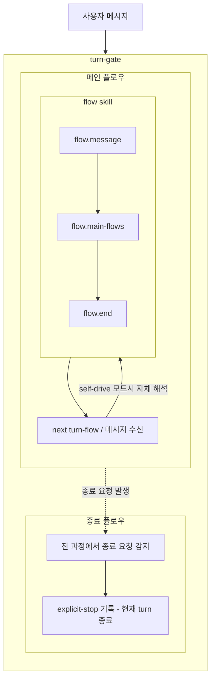

# turn-gate 사용자 의도

## 핵심

- `turn-gate`는 `flow`를 의존해 사용하는 wrapper입니다.
- 메인 플로우 안에는 `flow skill` 그룹과 `next turn-flow / 메시지 수신`을 둡니다.
- `flow skill` 그룹은 `flow.message -> flow.main-flows -> flow.end`로 봅니다.
- `next turn-flow / 메시지 수신`은 다음 사용자 입력을 기다리거나, self-drive 모드에서 자체 해석으로 다시 `flow skill`에 들어갑니다.
- 종료 플로우는 `turn-gate` 전체 과정에서 종료 요청을 감지해 현재 turn을 닫습니다.
