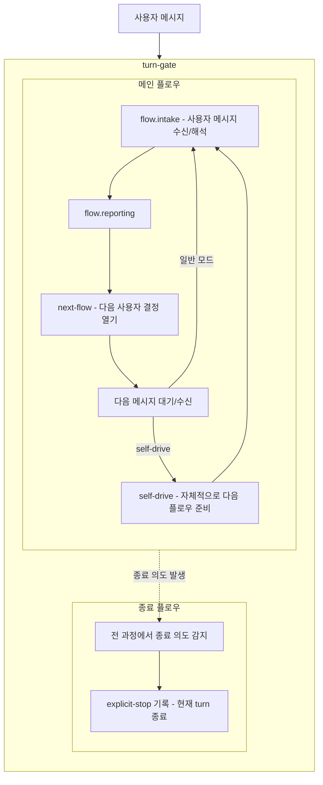

# turn-gate 사용자 의도

## 핵심

- `turn-gate`는 `flow`를 의존해 사용하는 wrapper입니다.
- 메인 플로우는 `flow.intake`에서 시작해 `flow.reporting` 뒤 `next-flow`로 이어집니다.
- 일반 모드는 다음 메시지 대기/수신 뒤 다시 `flow.intake`로 들어갑니다.
- self-drive는 사용자 메시지를 기다리지 않고 자체적으로 다음 플로우를 준비한 뒤 `flow.intake`로 들어갑니다.
- 종료 플로우는 `turn-gate` 전체 과정에서 종료 의도를 감지해 현재 turn을 닫습니다.
