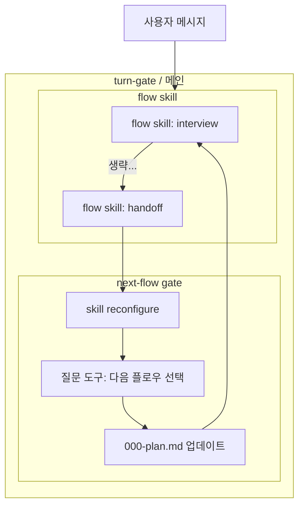
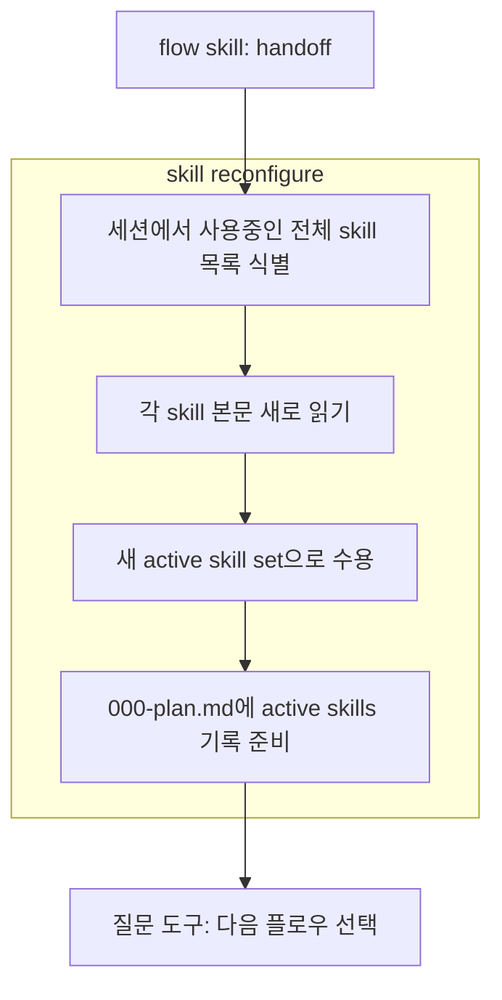
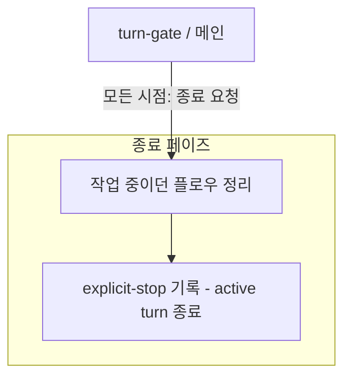

# turn-gate 사용자 의도

## 전체 루프

## skill reconfigure

## 종료 플로우

## 핵심

### wrapper 경계

- `turn-gate`는 `flow`를 의존해 사용하는 wrapper입니다.
- 사용자 메시지는 `turn-gate` wrapper 안의 `flow skill` 그룹으로 진입합니다.
- `flow skill` 그룹은 `flow skill: interview -> 생략... -> flow skill: handoff`를 포함합니다.
- `turn-gate`는 `flow skill` 내부를 재정의하지 않고 `flow` 스킬을 그대로 적용합니다.

### next-flow gate

- `next-flow gate`는 `flow skill: handoff -> skill reconfigure 그룹 -> 질문 도구: 다음 플로우 선택 -> 000-plan.md 업데이트` 순서입니다.
- `skill reconfigure` 그룹은 다음 flow 질문을 만들기 전에 세션에서 사용중인 전체 skill 목록을 식별하고, 각 skill 본문을 새로 읽고, 이전 대화의 stale skill context가 아니라 새 active skill set으로 수용합니다.
- `질문 도구: 다음 플로우 선택`은 다음 flow 입력을 고르는 question-routing 표면입니다.
- 질문 도구는 `flow: deep-interview`와 같은 인터뷰 흐름으로 다음 flow 입력을 충분히 구체화합니다.
- `000-plan.md 업데이트`는 선택된 다음 flow 입력, 사용 skill, pending/answered question 상태, next action을 매번 반영합니다.
- `flow skill: interview` 재진입 뒤에는 구체화된 입력을 기준으로 flow design에 필요한 질문을 우선합니다.

### 표시와 종료

- phase label은 사용자-facing phase 시작 또는 의미 있는 진행 메시지에 붙입니다.
- `turn-gate`는 `flow`가 산출한 phase label을 재정의하지 않고 적용합니다. `next-flow gate`를 열 때는 `turn-gate`가 `[next-flow]` label을 소유합니다.
- phase label은 진행 표시이며 artifact 본문, record 본문, command output summary, 질문 option label에 전파하지 않습니다.
- self-drive는 그래프 노드가 아니라 준비된 sequence gate가 질문 도구를 대체하는 핵심 경로입니다.
- 종료 플로우는 별도 그래프로 두고, `turn-gate / 메인`의 모든 시점에서 종료 요청이 오면 `종료 페이즈`로 이동합니다.
- 종료 페이즈는 `작업 중이던 플로우 정리 -> explicit-stop 기록 - active turn 종료` 순서입니다.
